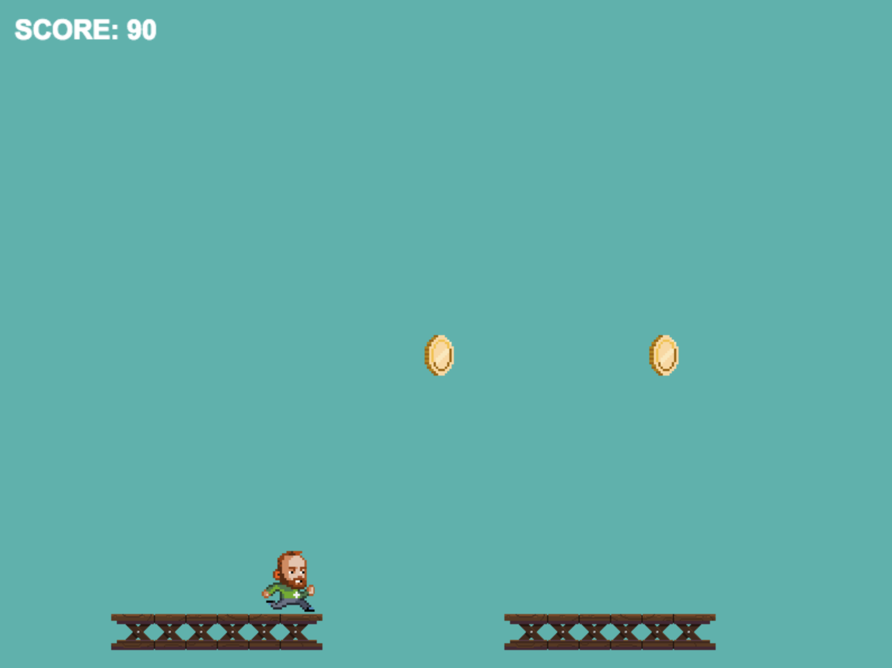

This is a simple game using start code from the Treehouse Javascript learning course, featuring the phaser.js HTML5 gaming framework. The simplest way to set up is to download the root folder and open in Google Chrome using the simple <a href="https://chrome.google.com/webstore/detail/web-server-for-chrome/ofhbbkphhbklhfoeikjpcbhemlocgigb?hl=en">Web Server for Chrome</a> app. 

Use the left and right arrows and jump with space bar to collect the coins and then the badge in order to display the You Won message.

Have fun!

